# video-cluster-analysis
Summarize the contents of a video using image clustering

## Motivation
Many applications involve collecting a continuous stream of signal data and detecting objects of interest. 
These signals may contain events of interest that are rare or not previously captured, which can make them
difficult to detect automatically. For example, a robot that autonomously navigates in an enviroment using
computer vision may be well designed to handle typical scenarios, but if a new environment or object not
previously seen is encountered that results in poor performance, it may be difficult to systematically
understand the issue without exhaustive manual analysis of the source video.

This project demonstrates an approach to this problem by performing an unsupervised analysis of a YouTube
video feed. By dividing each frame into smaller subimages and extracting relatively generalized image
features, trends and outliers can be detected in an automated and quantitative way to aid manual analysis
of the source video.

## Experiment
The following diagram outlines the high level steps of the `cluster_video.py` scripy:

### Setup
Python 3.9.7 was used for this experiment. The dependencies for the project can be installed with `make install`,
preferably inside a virtual environment.

The script `download_yt_video.py` can also be used to download a source video from YouTube to use for analysis.

### Iterate through video frames
The script loops through the frames of a video whose path is provided with a command line argument.
Since typical YouTube videos run at about 30 frames per second and subsequent frames are likely to contain
similar information, the script skips about a second's worth of frames to reduce the amount of computation
required.

### Extract subframes
For each video frame, a number of "subframes" consisting of non-overlapping square image tiles are identified.
The metadata of each subframe including its source frame number, timestamp, and pixel ranges are stored for
future analysis.

### Extract features
Even small subframes consisting of 40 x 40 pixels and 3 color channels contain 4,800 dimensions, a relatively
high number that that may cause poor clustering performance due to
[the curse of dimensionality](https://en.wikipedia.org/wiki/Curse_of_dimensionality).

For each subframe, features consisting of a histogram of each color channel are extracted to reduce the
dimensionality of the subframes and allow for matching subframes with similar colors based on Euclidean
distance.

### Cluster features
The clustering step first consists of standardizing the extracted features to have zero mean and unit
variance.  This standardization is particularly useful with a nearest-neighbors classifier, since it ensures
each feature is given equivalent "weight" when measuring distance.

The standardized features are then clustered using
[K-nearest neighbors](https://en.wikipedia.org/wiki/K-nearest_neighbors_algorithm). For identifying specific
objects in relatively complex source video, a setting of several hundred clusters may be appropriate.

## Results
The following figures show the subframes closest to the centroid of the 400 clusters created from the 14 minute video 
[Pittsburgh, Pennsylvania, USA 4K Drone Footage from the YouTube channel "ALL in 4k"](https://www.youtube.com/watch?v=BGsHLFg3nqI):

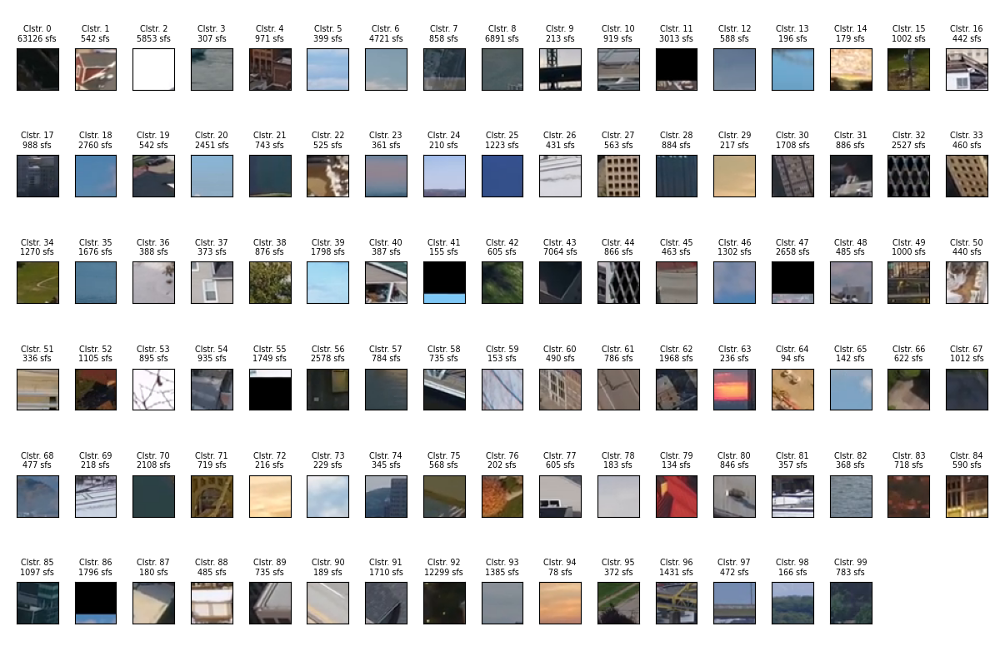
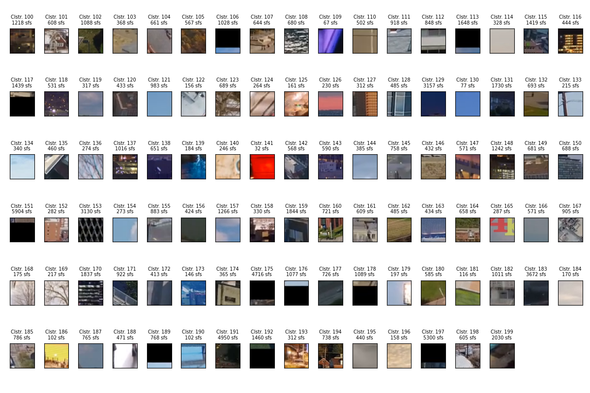
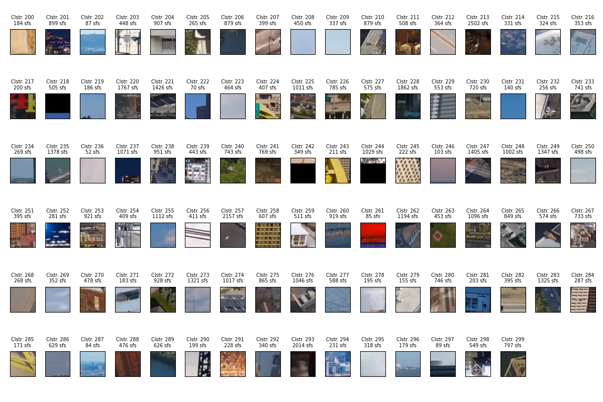
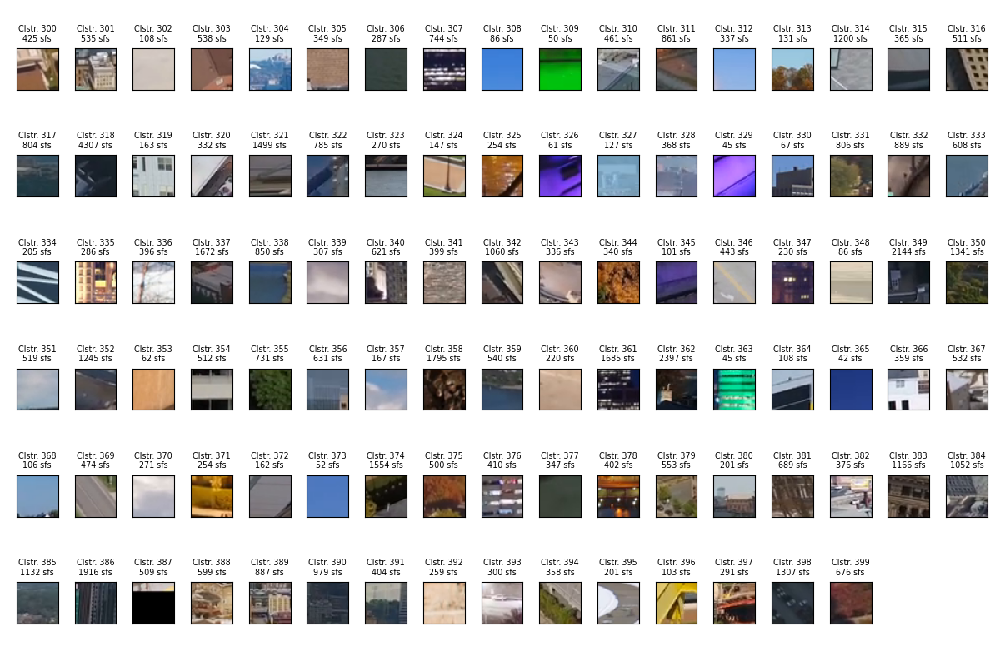

### Cluster-034, grassy area
The centroid subframe for cluster 34 is the following:

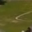

This cluster contains mainly grassy areas and trees. The example subframes shown below contain many grassy
green areas, as well as earthy areas. The peaks in the time distribution for the cluster shown below 
correspond to timestamps of resdidential areas as well as Point State Park downtown in the source video.

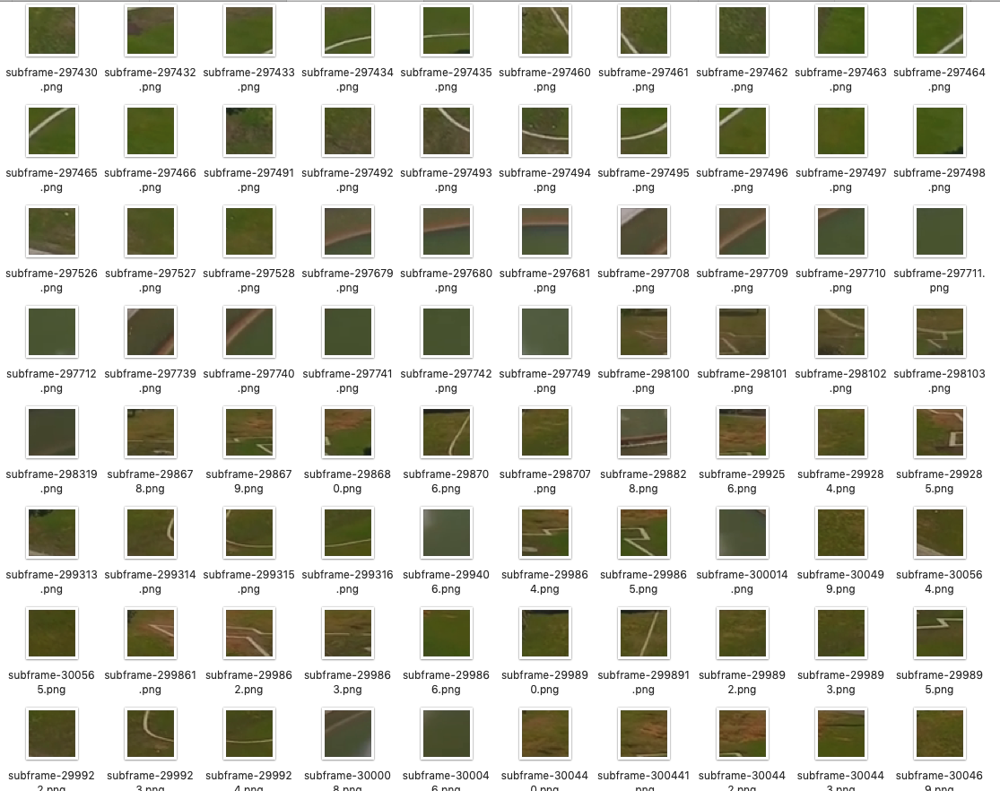

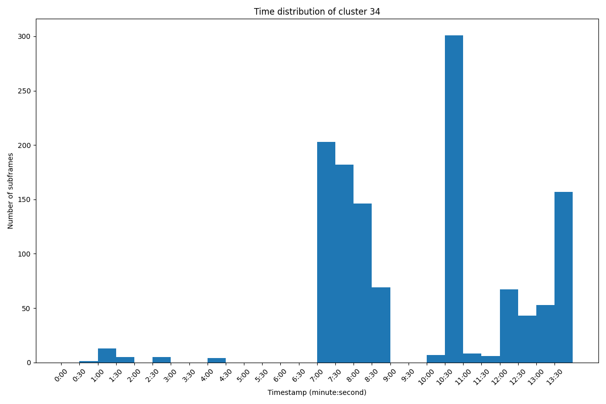

### Cluster-243, yellow bridge
The centroid subframe for cluster 243 is the following:

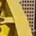

This cluster contains mainly a particular view of one of the city's famous yellow bridges. It also contains
a few subframes from other yellow objects, such as the sky at sunset and a bright yellow car, which can
be seen in the example subframes shown below.

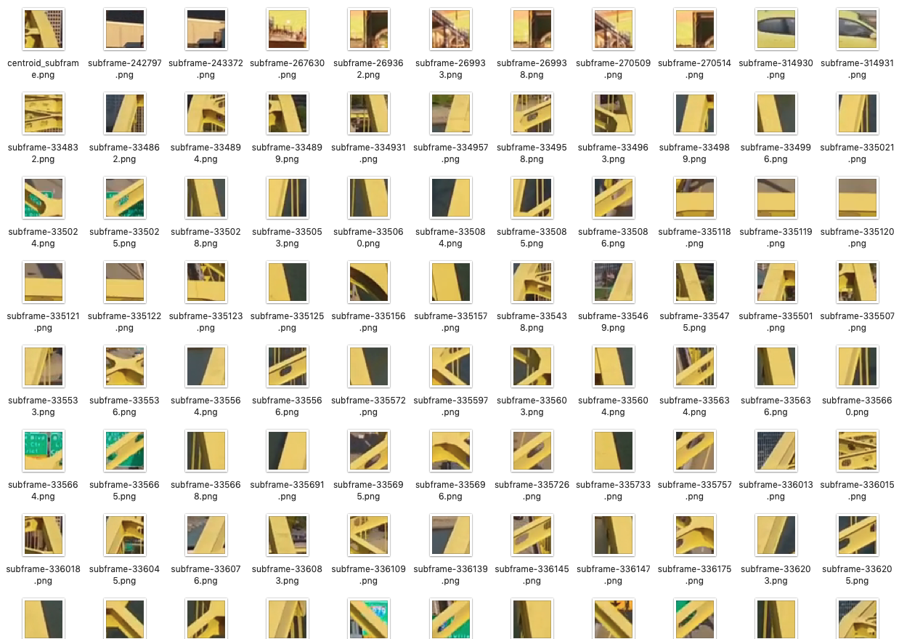

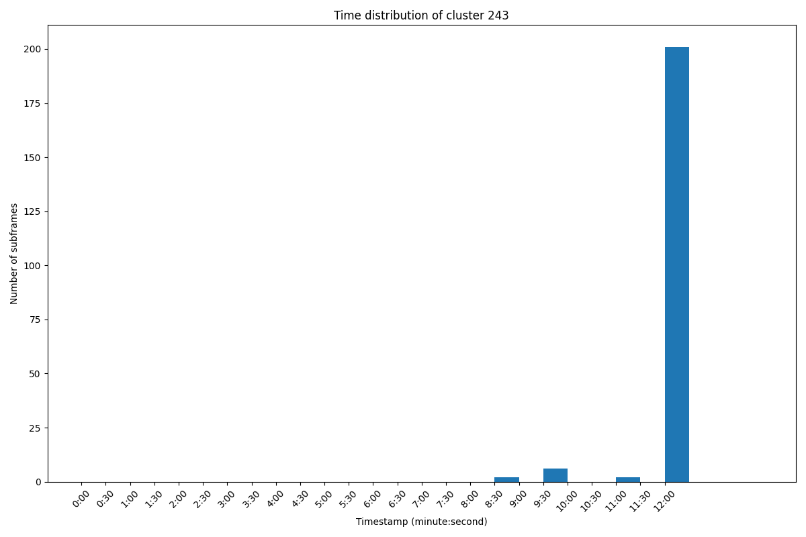

### Cluster-002, winter snow
The centroid subframe for cluster 002 is the following (almost entirely white):

This cluster contains subframes primarily of snowy winter scenes that occur between 12:30 and 13:30 of the
source video, as well as some clouds and other bright white areas from other parts of the video.

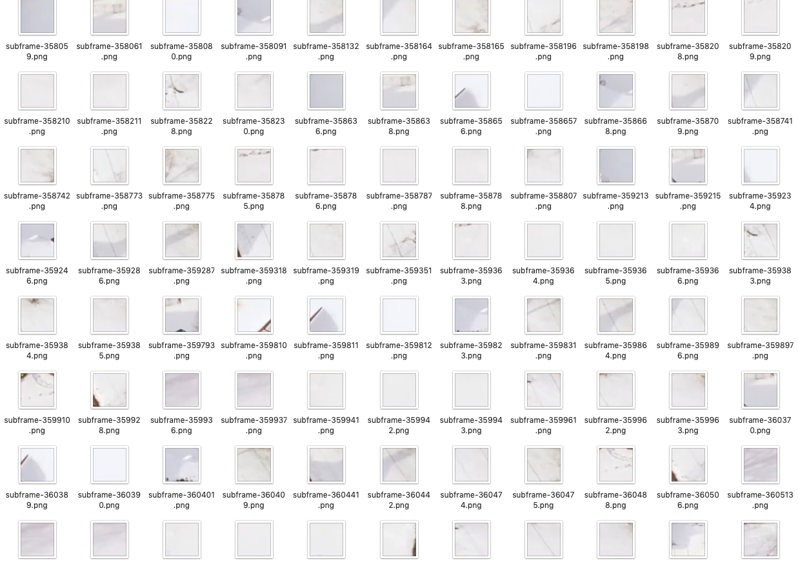

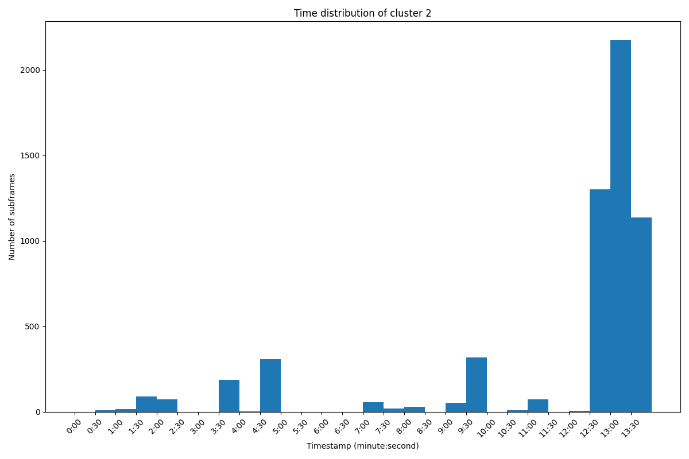

### Summary
The results above indicate that several classes of objects or scenery were effectively detected, some of
which are concentrated at a certain range of time, and others which are distributed across many scenes
in the video. The figures containing the centroid subframes may be used to explore other visual trends
in the source video to investigate other classes that may be expected or surprising.

Due to a lack of ground truth for objects in the source video, an evaluation of the accuracy of clustering
is difficult to quanitfy.

### Limitations
The color features selected are sensitive to changes in illumination. For example, one cluster may contain
subframes with similar colors that correspond to the sky at sunset, a brightly colored object in daylight,
as well as artificial lighting at night. If a result that is more illumination-invariant is desired,
using features such as edge strength or direction could be more effective.

A K-nearest neighbors approach requires specifying a number of clusters. For unknown source material, an
effective number may be difficult to identify. A clustering algorithm such as
[mean shift](https://en.wikipedia.org/wiki/Mean_shift) may be more appropriate, which requires a 
cluster bandwidth parameter instead of a set number of clusters.
